<p align="center">
  
</p>

<h1 align="center">Lelu</h1>

<p align="center">
  <strong>Authorization engine for AI agents.</strong><br/>
  Every action checked. Every decision logged. Humans in the loop when it matters.
</p>

<p align="center">
  <a href="https://github.com/lelu-ai/lelu/stargazers"></a>
  <a href="https://github.com/lelu-ai/lelu/actions/workflows/ci.yml"></a>
  <a href="https://github.com/lelu-ai/lelu/blob/main/LICENSE"></a>
  <a href="https://pypi.org/project/lelu-agent-auth-sdk/"></a>
  <a href="https://www.npmjs.com/package/lelu-agent-auth"></a>
  <a href="https://lelu-ai.com/sandbox"></a>
</p>

<p align="center">
  <a href="https://lelu-ai.com/sandbox"><b>Live Sandbox</b></a> ·
  <a href="#try-it-in-one-command"><b>One-Command Start</b></a> ·
  <a href="plugin-claude-code"><b>Claude Code Plugin</b></a> ·
  <a href="examples/"><b>Examples</b></a> ·
  <a href="sdk/mcp"><b>MCP Server</b></a> ·
  <a href="CONTRIBUTING.md"><b>Contributing</b></a> ·
  <a href="https://github.com/lelu-ai/lelu/discussions"><b>Discussions</b></a>
</p>

---

<p align="center">
  <picture>
    <source media="(prefers-color-scheme: dark)" srcset="docs/assets/lelu-flow.svg">
    
  </picture>
</p>

<p align="center">
  <picture>
    <source media="(prefers-color-scheme: dark)" srcset="docs/assets/lelu-terminal.svg">
    
  </picture>
</p>

## What is Lelu?

**Lelu is an open-source authorization engine that sits between your AI agent and the real world.** Before the agent takes any action — issuing a refund, sending an email, deleting a record — it asks Lelu first, and Lelu returns one of four decisions:

- ✅ **`allow`** — the action runs
- ⛔ **`deny`** — blocked, with a reason
- 🙋 **`human_review`** — the agent pauses until a human approve
- 🧪 **`compute`** — redirected to a safer alternative or sandbox

It's one HTTP call from any language or framework, every decision is written to an audit log, and the engine runs entirely on your own machine or infrastructure.

## Why Lelu?

**Give your agent a permission system it can't talk its way around.**

Okta tells you **who can do what**. Lelu tells you **when they're doing it wrong**. Traditional auth tools (OPA, Casbin, AWS AVP) block unauthorized access — they can't detect when a *legitimately authorized* agent is being manipulated by prompt injection, acting on low confidence, or behaving anomalously. Lelu closes that gap.

OPA, Casbin, and AWS AVP handle role & permission checks, but stop there. Lelu does that too, and adds:

- Prompt-injection detection (5-layer filter)
- LLM confidence gating on verified log-probs
- Human-in-the-loop pause → approve → resume (Slack / Teams / PagerDuty)
- Behavioral anomaly & reputation scoring
- A full audit log of every decision

---

## Try it in one command

No account, no Docker, no config — the real engine runs on your machine:

```bash
npx -y lelu-mcp start
```

Give **Claude Code** guardrails right now:

```bash
claude mcp add lelu -- npx -y lelu-mcp start --transport stdio
```

Your agent gets a `lelu_agent_authorize` tool: destructive actions denied, payments and outbound email routed to human review, production writes redirected to a sandbox, everything else default-denied. Rules live in `~/.lelu/policy.yaml`. Cursor / Claude Desktop setup and full docs → [sdk/mcp](sdk/mcp)

### Claude Code plugin — no tool-calling required

The MCP server above gives your agent a tool it can *choose* to call. The Claude Code plugin goes further: it hooks directly into every `Bash`, `Edit`, and `Write` call via Claude Code's own `PreToolUse` hook, so protection doesn't depend on the agent remembering to ask.

```bash
git clone https://github.com/lelu-ai/lelu.git && cd lelu
claude plugin marketplace add .
claude plugin install lelu@lelu
./plugin-claude-code/install.sh
```

Expansion-aware — `rm -rf ~/`, `rm -rf $HOME`, and reversed/separated/long-form flag variants are all caught, where a regex on the raw command text [catches 7/10 and false-positives on 4/4 benign commands](plugin-claude-code/benchmarks/report.md) — plus retry-storm detection and a session budget for runaway unattended sessions. **Shadow mode by default**, nothing blocks until you ask it to. Full docs → [plugin-claude-code](plugin-claude-code)

---

## Quickstart (SDK)

```bash
npm install lelu-agent-auth          # TypeScript — or: pip install lelu-agent-auth-sdk
```

```typescript
import { lelu } from "lelu-agent-auth";

// Zero-config: discovers the engine `npx lelu-mcp start` runs on this
// machine (URL + key live in ~/.lelu) — no account, nothing to configure.
// Self-hosted or cloud instead? lelu({ baseUrl, apiKey }).
const auth = lelu();

const decision = await auth.authorize({
  tool: "delete_record",
  context: { confidence: 0.82, actingFor: "user_42" },
});

if (decision.decision === "allow") {
  await deleteRecord(id);
} else if (decision.decision === "human_review") {
  await notifyReviewer(decision.requestId); // agent pauses, human approves, resumes
} else if (decision.decision === "compute") {
  await saferAlternative(decision.safeTool, decision.safeArgs); // redirected to sandbox
} else {
  throw new Error(decision.reason); // denied
}
```

**Four outcomes. Every decision audited. No other changes to how you build.** Works with OpenAI, Anthropic, LangChain, LangGraph, CrewAI, Vercel AI SDK, and MCP.

---

## How it works

Every action flows through a layered pipeline — the strictest outcome wins:

- **Prompt-injection filter** — 5 layers: exact → homoglyph → fuzzy → structural → entropy
- **Confidence gate** — verified LLM token log-probs¹ — low confidence → deny or downgrade
- **Policy evaluator** — YAML roles + OPA/Rego, deny-first, wildcard patterns
- **Risk model** — `criticality × (1 − confidence) × reliability × anomaly_factor`
- **Human-review queue** — uncertain decisions pause for approval (Slack / Teams / PagerDuty)
- **Behavioral analytics** — shadow-agent detection, reputation scoring, baseline drift alerts

¹ Read from the provider (OpenAI, some Bedrock families) — never self-reported by the agent. No signal available (e.g. Anthropic Claude)? The engine applies its `MissingSignalMode` policy instead of trusting a fabricated score.

Also in the box: stable agent identity with RS256 workload JWTs and MCP OAuth 2.1 · AES-256-GCM [OAuth token vault](docs/) with 8 auto-refresh providers · NHI inventory with OWASP top-10 checks (`/v1/nhi/inventory`).

**Stack:** Go engine · Next.js dashboard · SQLite (local) / Postgres (prod) · Redis (optional)

---

## Examples

- [quickstart](examples/quickstart) — the real engine on SQLite: one request per outcome, live prompt-injection catch
- [langchain](examples/langchain) — gate a plain LangChain `StructuredTool` before execution
- [crewai](examples/crewai) — gate CrewAI tool calls; a prompt-injected refund agent gets stopped
- [bedrock](examples/bedrock) — gate Amazon Bedrock agents on the model's *own verified* confidence
- [agentgateway](examples/agentgateway) — Lelu as the decision brain behind agentgateway (ext-authz PEP)

SDKs: [TypeScript](sdk/typescript) · [Python](sdk/python) · [Go](sdk/go) · [MCP server](sdk/mcp)

Self-hosting: `npx -y lelu-mcp start` runs the real engine with no build step, or build it yourself from source — `go build ./cmd/engine` or `docker build -f engine/Dockerfile .` — full options in [examples/quickstart](examples/quickstart).

---

## FAQ

<details>
<summary><b>Is it really free?</b></summary>

Yes — the engine, SDKs, MCP server, and dashboard are MIT licensed. Self-host everything with `npx -y lelu-mcp start`, or build the engine yourself from source. The hosted sandbox at lelu-ai.com is just a convenience.
</details>

<details>
<summary><b>Can't the agent just lie about its confidence?</b></summary>

No. Production engines only accept **verified** confidence signals — token log-probs read from the LLM provider, never a number the agent self-reports. When no verified signal exists, the engine applies its `MissingSignalMode` policy instead of trusting a fabricated score.
</details>

<details>
<summary><b>Does this replace OPA / Casbin / my IAM?</b></summary>

No — it sits on top. Lelu evaluates OPA/Rego and YAML policies as one step of its pipeline, then adds what those tools can't see: prompt-injection detection, confidence gating, behavioral anomaly scoring, and a human-review queue.
</details>

<details>
<summary><b>What happens when a decision is <code>human_review</code>?</b></summary>

The agent pauses, a reviewer gets pinged (Slack / Teams / PagerDuty), and the action resumes or dies with their verdict. Every decision — including the human's — lands in the audit log.
</details>

---

## Contributing

Contributions of every size are welcome — from a typo fix to a new framework integration. Most wanted right now: 🔌 framework integrations (LangChain, OpenAI Agents SDK, LlamaIndex), 📜 Rego policy templates (SOC 2, HIPAA, GDPR), and 📚 examples.

Pick up a [`good first issue`](https://github.com/lelu-ai/lelu/labels/good%20first%20issue), grab a [`help wanted`](https://github.com/lelu-ai/lelu/labels/help%20wanted) task, or start a thread in [Discussions](https://github.com/lelu-ai/lelu/discussions). Setup and guidelines → [CONTRIBUTING.md](CONTRIBUTING.md)

**If Lelu is useful to you, [a ⭐ star](https://github.com/lelu-ai/lelu/stargazers) helps more people find it — and tells us to keep going.**

---

MIT © [Lelu](https://lelu-ai.com)
