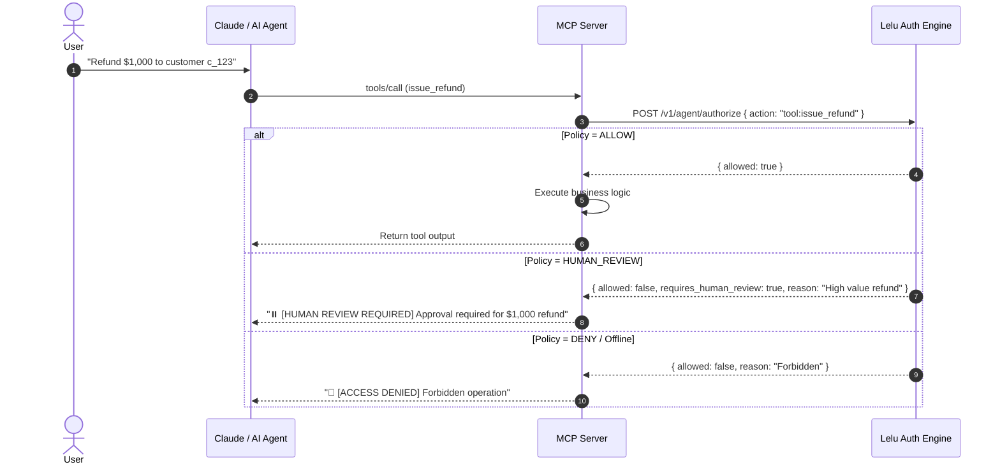

# Real-Time MCP Tool Authorization with Lelu

This example demonstrates how to integrate **Lelu Authorization** directly into a **Model Context Protocol (MCP)** server.

MCP gives AI agents the ability to invoke tools and access external systems. However, standard MCP lacks built-in real-time authorization. By routing every `tools/call` invocation through Lelu before execution, you can enforce least-privilege policies, trigger Human-in-the-Loop (HITL) review gates, and fail closed if unapproved operations are attempted.

---

## 🛡️ How It Works



### Authorization Decisions Handled
1. **`allow`**: Safe tool execution is allowed immediately (e.g. `read_customer_data`).
2. **`human_review`**: Destructive or high-value operations pause execution and require explicit approval (e.g. `issue_refund`).
3. **`deny`**: Unsafe or forbidden operations are blocked (e.g. `delete_production_database`).
4. **`compute`**: Lelu redirects the call to a safer tool/args (`safe_tool`/`safe_args`) instead of running what was asked for — this example runs the redirected call, never the original. `allowed: true` on the wire looks identical to a clean allow, so this and the scope-downgrade case are checked explicitly rather than trusting `allowed` alone.
5. **Fail-Closed**: If the Lelu engine is unreachable or offline, tool execution is blocked by default.

---

## 🚀 Quick Start

### 1. Start the Lelu Engine (Local)

Run the Lelu decision engine:

```bash
# From the repository root (Go engine)
go run ./engine/cmd/engine
# Or via Docker
docker run -p 8080:8080 ghcr.io/lelu-ai/lelu-engine:latest
```

The engine listens on `:8080` by default (override with `LISTEN_ADDR`) — that's what `LELU_URL` below points at.

### 2. Run the MCP Server

```bash
cd examples/mcp
node server.mjs
```

### 3. Run the Unit Test Suite

```bash
node test.mjs
```

---

## 🔌 Connecting to Claude Desktop / Cursor / Claude Code

Add the Lelu-authorized MCP server to your `claude_desktop_config.json`:

### macOS
`~/Library/Application Support/Claude/claude_desktop_config.json`

### Windows
`%APPDATA%\Claude\claude_desktop_config.json`

```json
{
  "mcpServers": {
    "lelu-tools": {
      "command": "node",
      "args": ["/absolute/path/to/lelu/examples/mcp/server.mjs"],
      "env": {
        "LELU_URL": "http://localhost:8080",
        "LELU_API_KEY": "lelu-dev-key",
        "LELU_ACTOR_ID": "claude-desktop-user"
      }
    }
  }
}
```

---

## 📦 Exposed Example Tools

| Tool Name | Risk Level | Default Lelu Decision |
|---|---|---|
| `read_customer_data` | 🟢 Low | `ALLOW` |
| `issue_refund` | 🟡 Medium/High | `HUMAN_REVIEW` |
| `delete_production_database` | 🔴 Critical | `DENY` |
